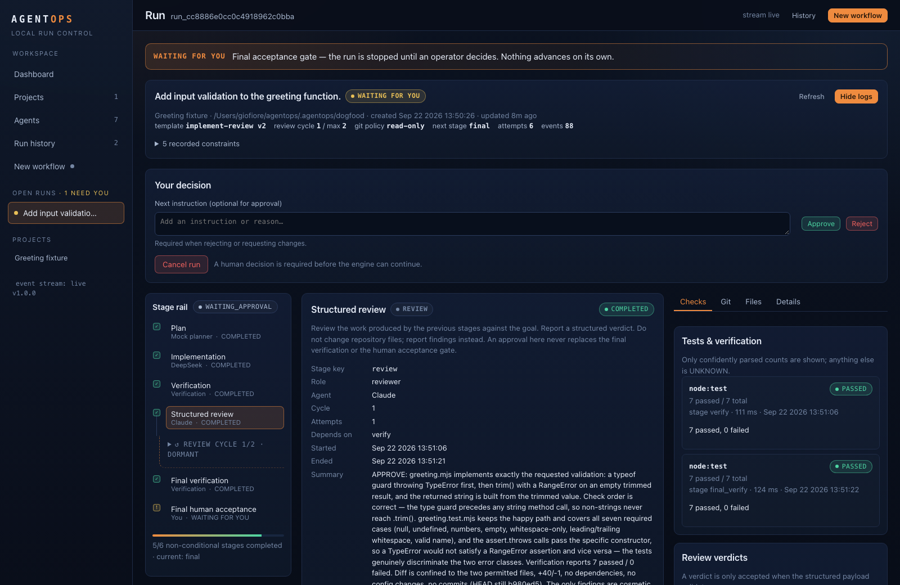

# AgentOps

Local-first mission control for orchestrating, reviewing and auditing AI coding agents.



AgentOps turns a coding goal into an inspectable local workflow: explicit prompts, owned processes, real verification commands, structured review, preserved retries, git checkpoints and a final human decision. Run records survive a browser refresh or backend restart.

V1 passes automated checks and a real DeepSeek → tests → Claude coding workflow. See [acceptance evidence and limits](docs/ACCEPTANCE.md).

## Quick start

Requires **Node.js 24+**, npm and Git on macOS or Linux. AI CLIs are optional: deterministic mock agents are included.

```sh
git clone https://github.com/Figo5/agentops.git
cd agentops
npm ci
npm run build
npm start
```

Open **http://127.0.0.1:4317**. Data stays in `~/.agentops/agentops.sqlite`. Set `AGENTOPS_DATA_DIR` to use another local data directory, or `AGENTOPS_PORT` to choose another loopback port. Never expose the port through a public tunnel.

1. **Add a project.** Enter its absolute git repository root and verification commands as an executable plus an argument array, for example `npm` and `["test"]`.
2. **Configure agents.** Use mock agents first, or configure installed Codex, Claude Code, Hermes/OpenCode or generic CLIs. Model names are editable; installation does not establish provider access.
3. **Create a workflow.** Choose a template, assign roles, enter a goal and constraints, then review the frozen stage plan before starting.
4. **Observe and decide.** Inspect exact prompts, live output, command results, diffs and review findings. Failed attempts remain visible when retried. A completed workflow waits for your acceptance.

Verification runs real local commands even when the agents are mocks. Mock agents simulate outcomes; they do not pretend to edit your repository.

## Supported agents

| Adapter              | Support                                                                                          |
| -------------------- | ------------------------------------------------------------------------------------------------ |
| Mock                 | Deterministic success, failure, fixes, rejection, retry, input wait and cancellation scenarios   |
| Generic CLI          | Executable + argument array; persisted prompt on stdin; bounded stdout/stderr                    |
| Codex CLI            | Noninteractive JSONL execution, configured model/effort, workspace or reviewer read-only sandbox |
| Claude Code          | Streaming JSON execution, structured reviewer verdicts, configured model/effort                  |
| Hermes / OpenCode Go | Configurable provider/model/reasoning through Hermes one-shot mode                               |
| Manual handoff       | Copy an exact saved prompt into an interactive tool and submit its result explicitly             |

The intended role setup is Astra/Codex for planning, DeepSeek/Hermes for implementation and Claude Code for review. Roles and display names are independent of adapter names. No API keys are stored by AgentOps. See [adapter configuration and boundaries](docs/ADAPTERS.md).

## What is recorded

Projects, agent configurations, workflow templates, frozen run plans, tasks, every execution attempt, exact prompt packets, output events, approvals, review verdicts, verification commands and results, git checkpoints, artifact references and reported usage. Search history by project, goal, agent, status, dates, branch and review verdict.

Reviewer exit code zero is not approval. Reviews must return a validated `APPROVE`, `APPROVE_WITH_FIXES` or `REJECT` object. Fixes loop through another verification and review, with a bounded cycle count. Overrides and final acceptance are recorded human decisions. Unknown test counts and usage remain **UNKNOWN**.

## Architecture

```text
React / Vite interface
        │ same-origin HTTP + SSE
Local Node.js service ── SQLite migrations + transactional audit records
        │
Persisted workflow engine
        ├── Agent adapters: mock / generic / Codex / Claude / Hermes / manual
        ├── Owned POSIX process supervisor
        ├── Verification executor + conservative test parsing
        └── Git snapshots, diffs and typed write policy
```

The orchestration engine has no React dependency. Agent adapters normalize vendor output while preserving redacted process logs. A lightweight supervisor owns each process group through cleanup. Startup marks live attempts interrupted and never silently relaunches them.

Read [DESIGN.md](DESIGN.md), [architecture](docs/ARCHITECTURE.md), [workflows](docs/WORKFLOWS.md) and [security](docs/SECURITY.md).

## Safety model

- Loopback binding, exact Host/Origin checks and per-server action tokens; no accounts or remote-access mode.
- Canonical project roots and artifact containment; no implicit repository reset, clean or stash.
- Argument arrays and `shell: false`; no primary arbitrary git command box.
- Bounded, redacted logs; inherited CLI credentials, never a credential database.
- Read-only git policy by default. Unsupported dangerous git writes are rejected.
- Owned process groups, timeout and bounded cancellation. Stored PIDs are never used to terminate processes.

**AgentOps is not an OS sandbox.** Trusted commands, package scripts and third-party coding agents run with your account's permissions. Workflow policy governs AgentOps-issued git operations. Hermes one-shot mode bypasses Hermes's interactive approvals and requires an explicit setting. AI CLIs may send repository context to their configured providers; AgentOps itself adds no cloud backend or telemetry.

## Development and validation

```sh
npm test
npm run typecheck
npm run build
npm run test:e2e
```

Tests use temporary repositories, SQLite databases, deterministic agents and local child processes. They do not require paid AI calls. Browser tests require Playwright Chromium (`npx playwright install chromium`). Acceptance evidence and real dogfood results are recorded in [docs/ACCEPTANCE.md](docs/ACCEPTANCE.md).

## V1 boundaries

macOS/Linux local operation; no Windows process-tree guarantee, remote agents, user accounts, cloud database or arbitrary DAG editor. Pipe-compatible noninteractive CLIs are supported; terminal-only workflows use manual handoff. Usage is adapter-dependent and never estimated as measured. Git checkpoints are metadata, not repository backups; large git output fails explicitly rather than becoming a partial authoritative snapshot. Log redaction is best effort. CLI provider availability is external to AgentOps.

No license has been selected for this repository.
