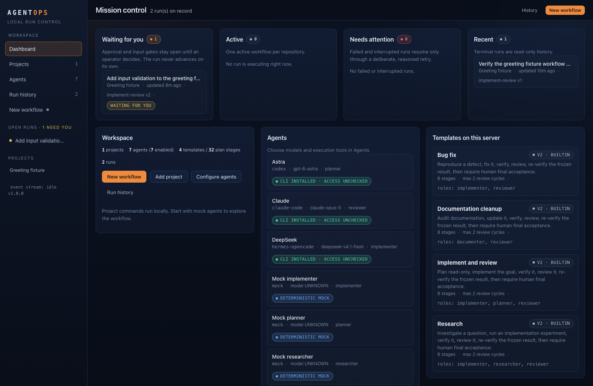

# V1 acceptance evidence

Validated locally on macOS on 2026-09-22. Automated tests use local fixtures and mock agents; they make no paid AI requests.

## Real coding workflow

Run `run_cc8886e0cc0c4918962c0bba` ran through the actual AgentOps service and SQLite store, against a disposable copy of `fixtures/demo-project`.

Goal: **Add input validation to the greeting function.**

| Stage              | Actor                                                         | Observed result                                 |
| ------------------ | ------------------------------------------------------------- | ----------------------------------------------- |
| Plan               | Deterministic mock planner                                    | Completed; explicitly simulated planning        |
| Implementation     | DeepSeek V4.1 Flash through Hermes / OpenCode Go, high effort | Changed only greeting.mjs and greeting.test.mjs |
| Verification       | AgentOps-owned `node --test` process                          | 7 passed, 0 failed                              |
| Review             | Claude Opus 5 through Claude Code, high effort                | Structured APPROVE, no blocking findings        |
| Final verification | A second AgentOps-owned `node --test` process                 | 7 passed, 0 failed                              |
| Final acceptance   | Human                                                         | WAITING FOR YOU; deliberately left pending      |

The real worker added TypeError checks for non-string input, RangeError checks for empty/whitespace-only input, trimming, and six regression tests alongside the existing valid-name test. Git recorded two changed files, +40/−1, with HEAD unchanged at `b980ed5`. No automatic commit was created. The fix branch was skipped because the reviewer approved; deterministic integration tests separately exercise the fixes/retest/review loop.

The service was stopped and restarted after reaching the final gate. The approval ID and all attempt states were unchanged, and no agent relaunched. Prompts, redacted output, review, command results and git checkpoints remained inspectable.

DeepSeek usage is UNKNOWN because its one-shot output supplied no trustworthy metrics. Claude's usage is provider-reported, not estimated by AgentOps. Codex invocation is covered by adapter tests and checked against installed CLI help; a paid Codex task was not part of this dogfood run.

## Validation

- TypeScript server/core and frontend checks.
- Production Vite build.
- Automated unit/integration/security coverage for persistence, transitions, review loops, retries, manual input, restart, process cleanup, git containment, redaction, test parsing, API access and UI state.
- Two Chromium end-to-end tests: first-run registration through final approval/history/reload, and failed-attempt retry with preserved history and reviewer verdict.
- Actual browser screenshots inspected after the real coding run.

Automated result: **206 tests passed, 0 failed**, plus **2 Chromium end-to-end tests passed**. TypeScript and the production build passed. Final product acceptance: **APPROVE by Astra**, at the user's explicit direction to substitute Astra's final review. Claude Code's attempted final product review returned HTTP 429 (session limit), not a verdict. This is distinct from Claude's successful earlier architecture/security reviews and its actual APPROVE verdict on the dogfood code. See [final acceptance review](reviews/FINAL-ACCEPTANCE.md).

## Screenshots

## Explicit boundaries

This is a local process coordinator, not an OS sandbox. macOS/Linux only; no PTY automation or Windows tree guarantee. Interactive-only tools use manual handoff. AgentOps cannot observe tool calls a CLI does not emit. Git writes are disabled by the shipped workflow policy; dangerous writes and deployments are not implemented. Custom template editing is deferred. Logs are bounded and redacted best-effort; git checkpoints are metadata, not backups. AI CLIs use their existing provider credentials and may send context to their providers. No license has been selected.
